# 👻 Ghost Profile — Enterprise Anti-Bot & DOM Hardening Engine (v4.2.0)

> **Ghost Profile v4.2.0** is an enterprise-grade client-side anti-fingerprinting and DOM prototype hardening engine for **Chromium** (Chrome, Brave, Edge, Opera) and **Mozilla Firefox** (Firefox, LibreWolf). Built specifically to eliminate prototype tampering artifacts and seamlessly bypass Tier-1 bot detection and anti-fraud engines (**ByteDance WebMSSDK/Slardar, Cloudflare Turnstile, DataDome, Kasada, and Akamai Bot Manager**) while preserving 100% native browser visual performance.

---

## 📦 Dual-Engine Repository Structure

This repository provides two dedicated builds tailored for their respective browser engines:

| Directory | Target Browsers | Engine & Architecture | Package Download |
| :--- | :--- | :--- | :--- |
| **[`ghost-profile/`](./ghost-profile)** | **Google Chrome, Microsoft Edge, Brave, Opera** | Chrome Side Panel API (`manifest.json` MV3) | [ghost-profile-chromium-v4.2.0.zip](https://github.com/somaylab/ghost-profile/releases/download/v4.2.0/ghost-profile-chromium-v4.2.0.zip) |
| **[`ghost-profile-firefox/`](./ghost-profile-firefox)** | **Mozilla Firefox, Firefox Dev, LibreWolf** | Firefox Sidebar Action API (`manifest.json` Gecko MV3) | [ghost-profile-firefox-v4.2.0.zip](https://github.com/somaylab/ghost-profile/releases/download/v4.2.0/ghost-profile-firefox-v4.2.0.zip) |

---

## 🌟 What's New in v4.2.0

* 🛡️ **Zero Own-Property Leak**: All spoofed properties (`innerWidth`, `deviceMemory`, `hardwareConcurrency`, etc.) are attached exclusively to prototype chains (`Window.prototype`, `Navigator.prototype`, `Screen.prototype`). `window.hasOwnProperty('innerWidth')` strictly returns `false`.
* 🎭 **V8 / SpiderMonkey Native Descriptor Masking**: Enforced exact `fn.name` formatting (`"get " + prop` for getters, `prop` for methods) and exact `fn.length`. Native `Function.prototype.toString` interception is governed via `WeakMap`.
* 🎨 **Smart Canvas Probe Isolation**: Canvas noise injection is strictly bounded to small probe canvases (`<= 320x320`). WebGL viewports, video editors, and high-resolution canvases remain 100% crystal-clear without visual distortion.
* 🎮 **WebGL Spec Compliance**: `gl.getParameter(0x0D3A)` (`MAX_VIEWPORT_DIMS`) returns a standard `Int32Array` instead of `Float32Array`. High-end GPU tiering emulates authentic **NVIDIA GeForce RTX 4080 (0x00002704)** Direct3D11 ANGLE profiles.
* 🔌 **Bidirectional Plugins & MimeTypes**: Standard Chromium/Firefox `PluginArray` / `MimeTypeArray` mapping where `plugin[0]` links to `MimeType` and `mimetype.enabledPlugin` links back to `plugin`.
* 🌐 **Dynamic Header Synchronization**: Real-time synchronization of `Accept-Language` headers and `Sec-CH-UA-*` Client Hints via `declarativeNetRequest`.

---

## 🛡️ 13-Point Stealth Protection Matrix

```mermaid
graph TD
    A[Ghost Profile v4.2 Engine] --> B[DOM & Prototype Hardening]
    A --> C[Hardware & GPU Emulation]
    A --> D[Deterministic Noise PRNG]
    A --> E[Network & Header Sync]
    A --> F[Global HAR Flow Engine]

    B --> B1["Prototype-Level Getters (Zero own-property)"]
    B --> B2["Native V8 Error & ToString Masking"]
    B --> B3["PluginArray / MimeTypeArray Linking"]

    C --> C1["RTX 4080 ANGLE D3D11 WebGL Pipeline"]
    C --> C2["16-Core CPU & 32GB RAM Emulation"]
    C --> C3["Viewport & Screen Resolution Clamping"]

    D --> D1["Canvas Probe Perturbation (<=320px)"]
    D --> D2["AudioContext Sub-Audible FFT Noise"]
    D --> D3["Font Metrics Jitter (measureText)"]

    E --> E1["Accept-Language Network Sync"]
    E --> E2["NavigatorUAData HighEntropyValues"]

    F --> F1["Passive Multi-Tab Interception"]
    F --> F2["DOM Action & Click Correlation"]
```

| # | Protection Module | Target Layer | Mechanism |
|---|---|---|---|
| 1 | **DOM Prototype Chain** | `Window`, `Navigator`, `Screen` | Property descriptors assigned to prototype chain; zero own-property leaks. |
| 2 | **Function Masking** | JavaScript Engine / `Function.prototype` | `WeakMap` native string masking with strict `get [name]` and `.length` compliance. |
| 3 | **WebGL / GPU Signature** | `WebGLRenderingContext`, `WebGL2` | ANGLE D3D11 NVIDIA GeForce RTX 4080 emulation + `Int32Array` viewport specs. |
| 4 | **Canvas Fingerprint** | `HTMLCanvasElement`, `Canvas2D` | Mulberry32 PRNG perturbation isolated strictly to probe canvases (`<= 320x320`). |
| 5 | **AudioContext Fingerprint** | `AudioBuffer`, `AnalyserNode` | Deterministic sub-audible micro-jitter (`±1e-7`) on frequency/time domain. |
| 6 | **Font Enumeration** | `CanvasRenderingContext2D` | Deterministic sub-pixel perturbation (`±0.1px`) on `measureText` bounding box. |
| 7 | **Client Hints API** | `NavigatorUAData` | High-entropy platform, architecture (`x86`), and bitness (`64`) alignment. |
| 8 | **Screen & Viewport** | `Screen`, `VisualViewport` | Coordinated resolution clamping (2560x1600), orientation, and pixel ratio. |
| 9 | **Media Devices** | `MediaDevices.prototype` | Synthetic virtual UUID device enumeration masking real microphones/cameras. |
| 10 | **Speech Synthesis** | `SpeechSynthesis.prototype` | Synchronized voice list based on active spoofed locale (`en-US`, `id-ID`). |
| 11 | **Battery & Storage** | `BatteryManager`, `StorageManager` | Native desktop battery simulation and quota masking. |
| 12 | **Date & Timezone** | `Date.prototype`, `Intl.DateTimeFormat` | Timezone offset and localized string formatting matching target locale. |
| 13 | **HTTP Header Engine** | `declarativeNetRequest` | Network-layer `Accept-Language` and Client Hint synchronization. |

---

## 📊 Forensic Audit & Battle-Tested Benchmarks

Ghost Profile v4.2 was subjected to a full forensic HAR network audit against **CapCut Web & ByteDance Anti-Fraud Gateway (PIPO Checkout)**.

| Metric | Result | Status |
|---|---|---|
| **Total Requests Audited** | **2,481 network entries** (265.6 MB HAR) | Complete Coverage |
| **ByteDance WebMSSDK Anti-Bot** | **25 / 25 requests passed** (`errno: 200`, `errmsg: success`) | ✅ 100% Passed |
| **Captcha Challenges** | **0 challenges triggered** | ✅ Zero Captcha |
| **Anti-Bot Blocking (403 / 429)** | **0 requests blocked** | ✅ Zero Blocks |
| **Telemetry Leakage** | 0 real hardware signals leaked in plaintext | ✅ Clean |
| **Target Outcome** | **Free Trial Rp 0 Plan Unlocked** + PIPO Cashier Gateway Opened | ✅ Success |

---

## 🛠️ Installation & Setup

### 🔵 Chromium Browsers (Google Chrome, Brave, Microsoft Edge, Opera)
1. Download [`ghost-profile-chromium-v4.2.0.zip`](https://github.com/somaylab/ghost-profile/releases/download/v4.2.0/ghost-profile-chromium-v4.2.0.zip) from [Releases](https://github.com/somaylab/ghost-profile/releases/tag/v4.2.0).
2. Extract the zip archive to a local folder.
3. Open your browser and navigate to `chrome://extensions/` (or `brave://extensions/` / `edge://extensions/`).
4. Enable **Developer mode** (toggle in the top-right corner).
5. Click **Load unpacked** (top-left) and select the extracted folder.
6. Click the extension icon or open the **Chrome Side Panel** to launch the Ghost Profile console.

### 🟠 Mozilla Firefox (Firefox, Firefox Developer Edition, LibreWolf)
1. Download [`ghost-profile-firefox-v4.2.0.zip`](https://github.com/somaylab/ghost-profile/releases/download/v4.2.0/ghost-profile-firefox-v4.2.0.zip) from [Releases](https://github.com/somaylab/ghost-profile/releases/tag/v4.2.0).
2. Extract the zip archive to a local folder.
3. Open Firefox and navigate to `about:debugging#/runtime/this-firefox`.
4. Click **Load Temporary Add-on...** and select `manifest.json` in the extracted folder.
5. Open the native **Firefox Sidebar** (`Ctrl + B` or click the toolbar icon) to launch the Side Panel.

---

## 🕹️ Features & Usage

### 1. Identity & Spoofing Console
* **Profile Presets**: Instantly switch between curated hardware profiles (e.g., *GeForce RTX 4080 / 16c / 32GB RAM / 2560x1600*).
* **Stealth Switches**: Toggle specific protection modules independently (Canvas, Audio, WebGL, Screen, Timezone, Fonts, Media Devices).
* **Bilingual Support**: Instant toggle between **English** and **Bahasa Indonesia**.

### 2. Multi-Tab HAR & Flow Recording Engine
* **Passive Traffic Capture**: Global network logger capturing requests across all active tabs, popups, and iframes without debugger infobars.
* **Interaction Breadcrumbs**: Connects user clicks, form submissions, and DOM events directly to their corresponding API requests.
* **Instant Export**: Export clean `.har` (HAR 1.2 compliant) and structured `.json` flow records with a single click.

---

## ⚖️ License & Ethical Notice

This project is licensed under the **MIT License**.

> **Notice**: Ghost Profile is developed for authorized academic security research, defensive hardening, privacy preservation, and local laboratory testing. Ensure all testing activities comply with applicable laws and terms of service.
